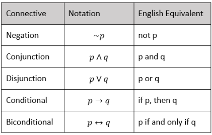
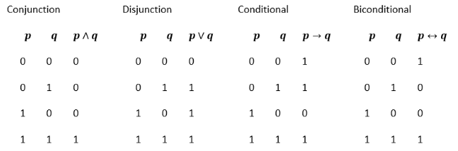
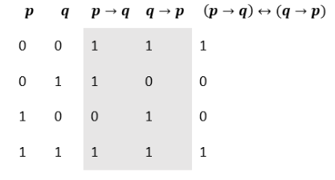

FORMAL LOGIC AND MATHEMATICAL PROOFS

Informally, logic studies how some statements lead to certain consequences.

- Each line of a chain of reasoning that is either true or false is called a statement
- A collection of statements is called an argument
- Exactly one statement of an argument is called the conclusion
- All other statements of the argument are called premises
- An argument is called valid if the conclusion must be true when all the premises
  are true
- Any argument that is not valid is called invalid

Logical connectives are words or symbols that connect or modify propositions.

- Negation: ~p
- Conjunction: p ∧ q
- Disjunction: p ∨ q
- Implication: p → q (is true if p is false or q is true)
- Bicondition: p ↔ q (is true if p and q are both true or both false)

Summary:

Truth table:

A conditional, "if p, then q" looks like this:

p → q

The **converse** is the conditional in the opposite direction, "if q, then p," which looks
as follows:

q → p

To see if they are equivalent make a truth table:

So, if p implies q, it is not necessarily true that q implies p. This should make
some sense intuitively.

Take this proposition:

(p → q) ∧ (q → r) → (p → r)

The **transitivity law** says that regardless of the truth-values of the propositions
p, q, and r, the proposition is true. Therefore, anytime we can prove p implies q and q
implies r, we have automatically proven p implies r.

**De Morgan's Law**:

~ (p ∧ q) ↔ (q ∨ r)

In simpler words, this says that "p and q are not both true" is equivalent to stating
"p is not true, or q is not true."

There's another De Morgan's law that can be written as:

~ (p ∨ q) ↔ (q ∧ r)

This one says that "p or q is not true" (keeping in mind this is the inclusive "or") is
equivalent to "p is not true and q is not true".

**Direct mathematical proof**: the structure of any mathematical proof has some things
in common: each step leads logically to the next. Constructing a valid proof, however,
must follow very strict deductive steps.

> (...) mathematical proofs establish quite possibly the closest thing to absolute truth
> humans can produce

**Proof by contradiction**

It's a method of proof where you assume the claim is false and through logical deductions
the assumption results in a contradition (so the claim must be true).

**Proof by mathematical induction**
Mathematical induction allows us to prove each of an infinite sequence of logical
statements, p 1 , p 2 , ..., is true. The argument involves two steps:

- Basis step: Prove p 1 is true.
- Inductive step: For a fixed i ≥ 2 value, assume p i-1 is true and prove p i is true.

If both steps are done successfully, the conclusion is that p 1 , p 2 , ... are all true.
